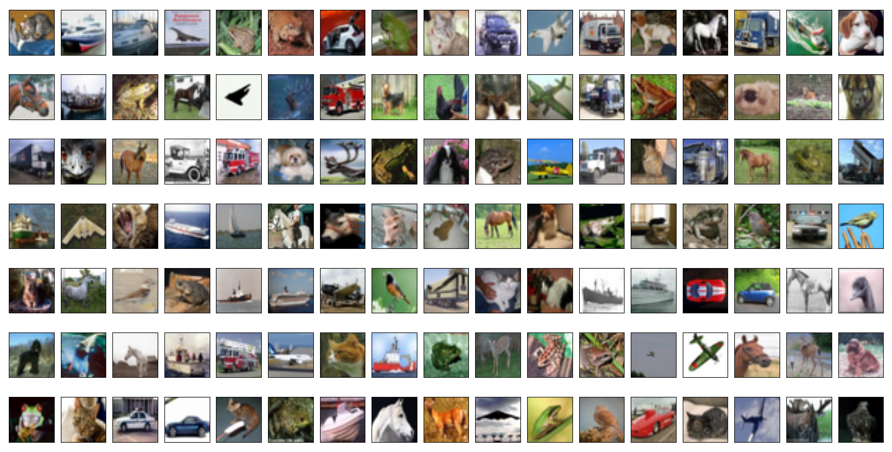

# cifar_10_100.py

This python module provides a simple to use function to download and extract the CIFAR-10 and CIFAR-100 database of coloured images that were collected by [Alex Krizhevsky, Vinod Nair, and Geoffrey Hinton](http://www.cs.toronto.edu/~kriz/cifar.html).

**Function:**

    load_CIFAR(db, path=None, normalise=True, flatten=True, onehot=True)

_arg_:

     db - int : Dataset annotation. Accepted value is either 10 or 100 to
                refer to CIFAR-10 or CIFAR-100 datasets.

_kwargs:_ 

    path - str: MNIST datasets directory. Default to current directory/MNIST.
                Create if nonexistant. Download any missing MNIST files.
    normalise - boolean: yes -> pixel RGB values [0,255] divided by 255.
                         no  -> pixel RGB values [0,255].
    flatten   - boolean: yes -> pixels of each image stored as 1D numpy array.
                         no  -> pixels of each image stored as 2D numpy array.
    onehot    - boolean: yes -> labels stored as one-hot encoded numpy array.
                         no  -> labels values used.

_Returns a nested dictionary:_

     {'train': {'images': train_images, 'labels': train_labels},
      'test': {'images': test_images, 'labels': test_labels}}
     where,
      train_images = CIFARimages(batch_label=[byte strings],
                                 filenames=[byte strings],
                                 nimages=50000,
                                 nrows=32, ncols=32,
                                 pixels=np.array())
            if normalise, pixels dtype='float64'
            else,         pixels dtype='uint8'
            if flatten,   pixels.shape=(50000, 3072)
            else,         pixels.shape=(50000, 3, 32, 32)
      train_labels = CIFAR10labels(batch_label=[byte strings],
                                   nlabels=50000,
                                   labels_str=() with 10 byte-str,
                                   labels=np.array() dtype='uint8')
            if onehot,    labels.shape=(50000, 10)
            else,         labels.shape=(50000)
      train_labels = CIFAR100labels(batch_label=[byte strings],
                                    nlabels=50000,
                                    coarse_labels_str=() with 20 byte-str,
                                    fine_labels_str=() with 100 byte-str,
                                    coarse_labels=np.array() dtype='uint8',
                                    fine_labels=np.array() dtype='uint8')
            if onehot,    coarse_labels.shape=(50000, 20)
                          fine_labels.shape=(50000, 100)
            else,         coarse_labels.shape=(50000)
                          fine_labels.shape=(50000)
     test_images = CIFARimages(batch_label=[byte strings],
                               filenames=[byte strings],
                               nimages=50000,
                               nrows=32, ncols=32,
                               pixels=np.array())
            if normalise, pixels dtype='float64'
            else,         pixels dtype='uint8'
            if flatten,   pixels.shape=(10000, 3072)
            else,         pixels.shape=(10000, 3, 32, 32)
     test_labels = CIFAR10labels(batch_label=[byte strings],
                                 nlabels=10000,
                                 labels_str=() with 10 byte-str,
                                 labels=np.array() dtype='uint8')
            if onehot,    labels.shape=(10000, 10)
            else,         labels.shape=(10000)
     test_labels = CIFAR100labels(batch_label=[byte strings],
                                  nlabels=10000,
                                  coarse_labels_str=() with 20 byte-str,
                                  fine_labels_str=() with 100 byte-str,
                                  coarse_labels=np.array() dtype='uint8',
                                  fine_labels=np.array() dtype='uint8')
            if onehot,    coarse_labels.shape=(10000, 20)
                          fine_labels.shape=(10000, 100)
            else,         coarse_labels.shape=(10000)
                          fine_labels.shape=(10000)
*Remarks:*

`CIFARimages()`, `CIFAR10labels()` and `CIFAR100labels()` are [dataklass objects](https://github.com/dabeaz/dataklasses). On my system, they performed ~25x faster than python3 built-in [dataclass objects](https://docs.python.org/3/library/dataclasses.html) and 5x faster than [namedtuple](https://docs.python.org/3/library/collections.html?highlight=namedtuple#collections.namedtuple).

    CIFAR10labels().labels_str = (
        'airplane', 'automobile', 'bird', 'cat', 'deer',
        'dog', 'frog', 'horse', 'ship', 'truck')

    cifar100labels().coarse_labels_str = (
        'aquatic mammals', 'fish', 'flowers', 'food containers',
        'fruit and vegetables', 'household electrical devices',
        'household furniture', 'insects', 'large carnivores',
        'large man-made outdoor things', 'large natural outdoor scenes',
        'large omnivores and herbivores', 'medium-sized mammals',
        'non-insect invertebrates', 'people', 'reptiles', 'small mammals',
        'trees', 'vehicles 1', 'vehicles 2')

    cifar100labels().fine_labels_str = (
        'beaver', 'dolphin', 'otter', 'seal', 'whale',
        'aquarium fish', 'flatfish', 'ray', 'shark', 'trout',
        'orchids', 'poppies', 'roses', 'sunflowers', 'tulips',
        'bottles', 'bowls', 'cans', 'cups', 'plates',
        'apples', 'mushrooms', 'oranges', 'pears', 'sweet peppers',
        'clock', 'computer keyboard', 'lamp', 'telephone', 'television',
        'bed', 'chair', 'couch', 'table', 'wardrobe',
        'bee', 'beetle', 'butterfly', 'caterpillar', 'cockroach',
        'bear', 'leopard', 'lion', 'tiger', 'wolf',
        'bridge', 'castle', 'house', 'road', 'skyscraper',
        'cloud', 'forest', 'mountain', 'plain', 'sea',
        'camel', 'cattle', 'chimpanzee', 'elephant', 'kangaroo',
        'fox', 'porcupine', 'possum', 'raccoon', 'skunk',
        'crab', 'lobster', 'snail', 'spider', 'worm',
        'baby', 'boy', 'girl', 'man', 'woman',
        'crocodile', 'dinosaur', 'lizard', 'snake', 'turtle',
        'hamster', 'mouse', 'rabbit', 'shrew', 'squirrel',
        'maple', 'oak', 'palm', 'pine', 'willow',
        'bicycle', 'bus', 'motorcycle', 'pickup truck', 'train',
        'lawn-mower', 'rocket', 'streetcar', 'tank', 'tractor')

# How to use?

    from cifar_10_100 import load_CIFAR            # Import function from module
    db10 = load_CIFAR(10)                          # Get CIFAR-10 database using default settings
    train_images = db10['train']['images'].pixels  # A 50000x3072 numpy array with float64 values    
    train_labels = db10['train']['labels'].labels  # A 50000x10 numpy array with uint8 values
    test_images = db10['test']['images'].pixels   # A 10000x3072 numpy array with float64 values    
    test_labels = db10['test']['labels'].labels   # A 10000x10 numpy array with uint8 values

    db100 = load_CIFAR(100)                                 # Get CIFAR-100 database using default settings
    train_images = db100['train']['images'].pixels          # A 50000x3072 numpy array with float64 values    
    train_flabels = db100['train']['labels'].fine_labels    # A 50000x100 numpy array with uint8 values
    train_clabels = db100['train']['labels'].coarse_labels  # A 50000x20 numpy array with uint8 values
    test_images = db100['test']['images'].pixels            # A 10000x3072 numpy array with float64 values    
    test_flabels = db100['test']['labels'].fine_labels      # A 50000x100 numpy array with uint8 values
    test_clabels = db100['test']['labels'].coarse_labels    # A 50000x20 numpy array with uint8 values

You can also see [example.py](example.py).